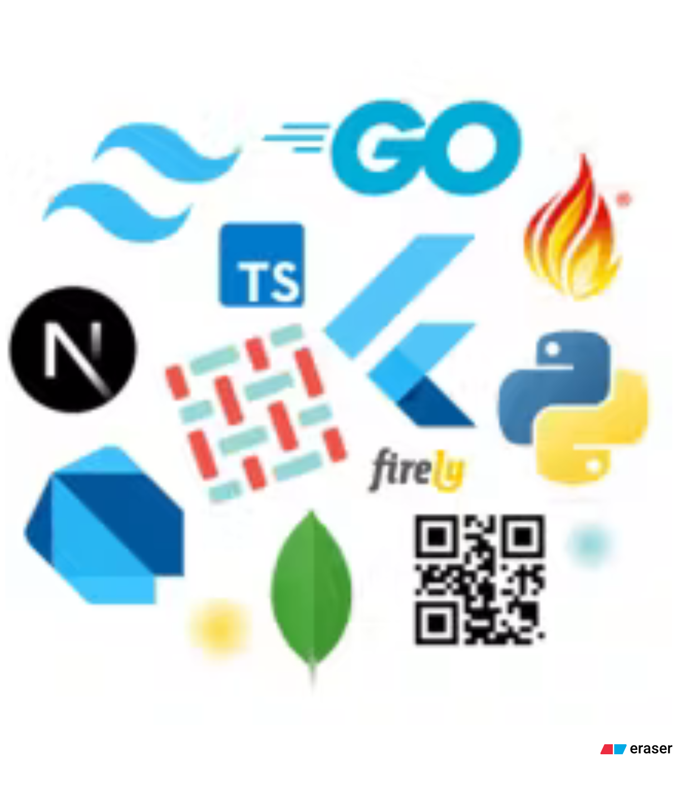
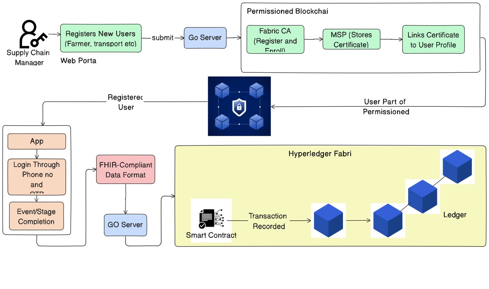
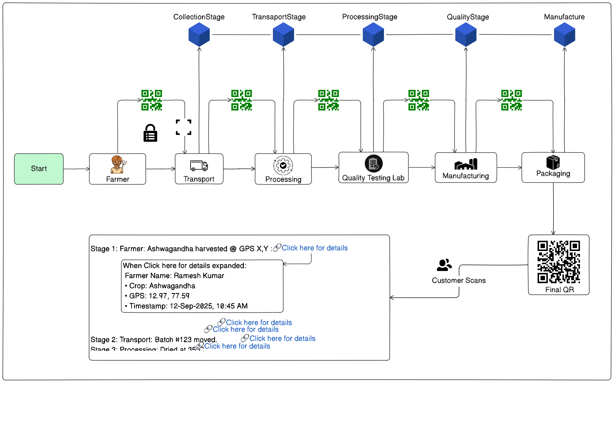
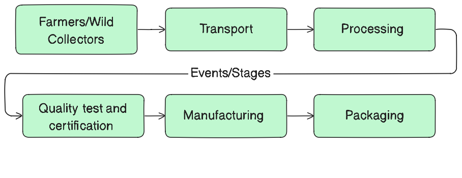

#  Herbtrace 🌿 Ayurvedic Herb Traceability using Blockchain  

## Overview  
The Ayurvedic herbal supply chain is traditionally fragmented and opaque, leading to risks of mislabeling, adulteration, and non-compliance with sustainability standards.  

This project delivers a **blockchain-powered traceability platform** that ensures **end-to-end provenance, transparency, and trust** from geo-tagged collection of herbs to the final Ayurvedic formulation packaging.  

---

## Solution Highlights  
- **Geo-tagged Collection** - Farmers and collectors record harvest events with GPS, timestamps, and quality metrics.  
- **Permissioned Blockchain (Hyperledger Fabric)** – Immutable storage of all supply-chain transactions.  
- **FHIR-Compliant Metadata** - Standardized event bundles (CollectionEvent, ProcessingStep, QualityTest) for interoperability.  
- **Smart Contracts** - Enforce sustainability rules, geo-fencing, seasonal restrictions, and quality thresholds.  
- **Smart Labeling** - On-chain generated QR codes linked to every batch.  
- **Consumer Transparency** - Customers scan QR codes to instantly verify product provenance.  

---

<table>
  <tr>
    <td>

<b>🛠 Tech Stack</b>  

| Layer | Technology |
|-------|------------|
| **Frontend (Web)** | Next.js, TypeScript, TailwindCSS |
| **Mobile dApp** | Flutter (cross-platform) |
| **Backend Services** | FastAPI (Python) |
| **Blockchain Gateway** | Go (Hyperledger Fabric transactions, smart contracts, enrollment) |
| **Database/Storage** | MongoDB |
| **Interoperability** | FHIR-compliant data bundles |

</td>
    <td>
        
    </td>
  </tr>
</table>

## ⚙️ System Architecture  

### 🔐 Technical Flow  
- Supply Chain Manager onboards farmers, transporters, processors, and labs.  
- Users authenticate via phone/OTP.  
- Events are recorded → validated via smart contracts → stored on-chain.  
- Blockchain ensures tamper-proof provenance and trust.  

## Architecture Diagram:  

---

## 🌿 End-to-End Workflow  

1. **Collection (Farmer/Wild Collector)**  
   - GPS, timestamp, species ID, and quality metrics.  
   - Smart contracts validate sustainable harvesting rules.  

2. **Transport & Storage**  
   - Chain-of-custody events logged immutably.  
   - Prevents swaps and adulteration.  

3. **Processing**  
   - Drying, grinding, and storage conditions recorded.  
   - Only compliant methods accepted on-chain.  

4. **Quality Testing**  
   - Lab results (moisture, pesticide, DNA barcoding) digitally signed & stored.  

5. **Manufacturing**  
   - Batch formulation linked to certified raw herbs.  
   - GMP and sustainability compliance enforced.  

6. **Packaging & Labeling**  
   - Blockchain-generated QR codes per product batch.  
   - Customers scan to verify provenance instantly.  

## Workflow Diagram:  

---

## Key Benefits  
- **Tamper-Proof Records** – Immutable blockchain ledger.  
- **Geo-Tagged Traceability** – Complete farm-to-formulation tracking.  
- **Regulatory Compliance** – Automated validation of sustainability and quality rules.  
- **Consumer Trust** – Transparent QR-based verification.  
- **Scalable & Interoperable** – Works with IoT devices, SMS gateways, and ERP integrations.  

---

## Demonstration  
Pilot implementation showcases **Ashwagandha batch traceability**:  
- Farmer harvest → Transport → Lab certification → Manufacturing → Packaging → Customer scan.  
- Final QR reveals full provenance, lab certificates, and sustainability compliance in seconds.

